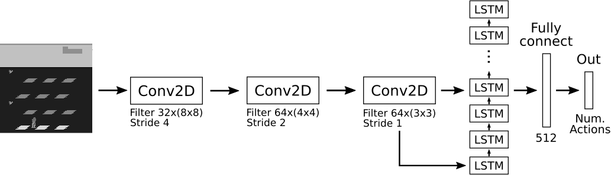

Comparison Beetwen LSTM and GRU Cells for DRQN

Take as base the following repository from Marc Tuscher:

`https://github.com/marctuscher/DRQN-tensorflow`

Architecture of DRQN A layer of LSTM cells is added to a DQN architecture

Architecture of DGRQN a layer of GRU Cells is added to the last layer of DQN

